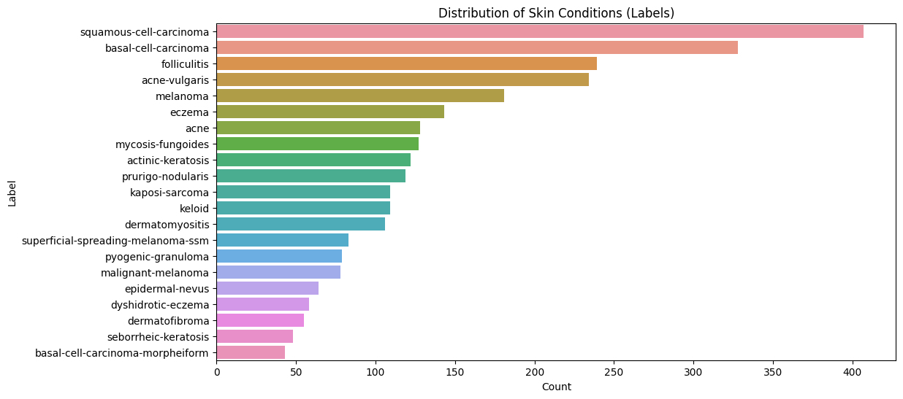
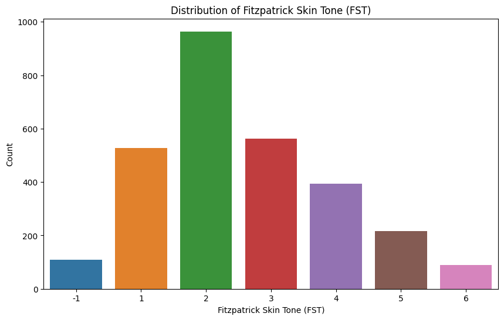
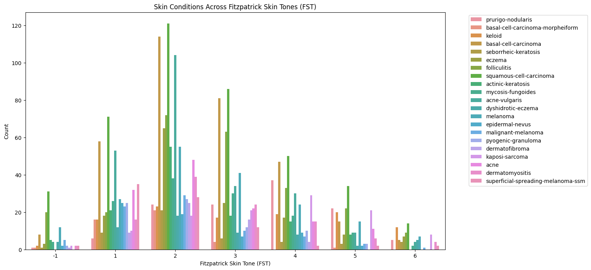

# GitHub Kaggle Project README Template

⚠️ _Remember to update the above title and remove all guidance notes and examples in this template, before finalizing your README_

---

### **👥 Team Members**

| Name | GitHub Handle | Contribution |
| ----- | ----- | ----- |
| Ariel Trusty | @Artrusty | Built CNN model, performed data augmentation |
| Claire Cho | @claireecho | Led EDA, visualized dataset distributions, handled missing data |
| Enrista Ilo | @enrista2112 | EDA and data augmentation |
| Oyu Enkhbold | @oyu-e | Implemented explainability tools |
| Zeynep Tasoglu | @ | Implemented explainability tools |
| Zuha Taha | @ | Implemented explainability tools |

---

## **🎯 Project Highlights**

**Example:**

* Built a \[insert model type\] using \[techniques used\] to solve \[Kaggle competition task\]
* Achieved an F1 score of \[insert score\] and a ranking of \[insert ranking out of participating teams\] on the final Kaggle Leaderboard
* Used \[explainability tool\] to interpret model decisions
* Implemented \[data preprocessing method\] to optimize results within compute constraints

🔗 [Equitable AI for Dermatology | Kaggle Competition Page](https://www.kaggle.com/competitions/bttai-ajl-2025/overview)
🔗 [WiDS Datathon 2025 | Kaggle Competition Page](https://www.kaggle.com/competitions/widsdatathon2025/overview)

---

## **👩🏽‍💻 Setup & Execution**

**Provide step-by-step instructions so someone else can run your code and reproduce your results. Depending on your setup, include:**

* How to clone the repository
* How to install dependencies
* How to set up the environment
* How to access the dataset(s)
* How to run the notebook or scripts

---

## **🏗️ Project Overview**

**Describe:**

* The Kaggle competition and its connection to the Break Through Tech AI Program
* The objective of the challenge
* The real-world significance of the problem and the potential impact of your work

---

## **📊 Data Exploration**

**Describe:**

* The dataset(s) used (i.e., the data provided in Kaggle \+ any additional sources)
* Data exploration and preprocessing approaches
* Challenges and assumptions when working with the dataset(s)

**Potential visualizations to include:**

* Plots, charts, heatmaps, feature visualizations, sample dataset images

---

## **🧠 Model Development**

We used a convolutional neural network (CNN) with transfer learning, leveraging a pre-trained ResNet-50 model. On top of this, we added a custom classification head consisting of a global average pooling layer, a dense ReLU layer with dropout for regularization, and a layer with the softmax function to output probabilities for each skin condition class.

To optimize for Google Colab’s free tier GPU memory and runtime limits, we used slightly smaller image input sizes (160x160) instead of the standard sizes. This allowed us to speed up training and inference without significant drops in performance. This helped make the process more efficient and scalable on limited hardware.

We developed data exploratory analysis and used extensive data augmentation with ImageDataGenerator to increase dataset diversity and reduce overfitting. Augmentations included rotation, width/height shifts, horizontal/vertical flips, shear, zoom, and brightness adjustments. These were all useful for classifying skin condition images with varied orientation and lighting conditions.

The training set comprised 80% of the data, with the remaining 20% used for validations. Labels were encoded with Label Encoder, and the model was trained with Adam optimizer with a learning rate of 0.0001. We used early stopping and model checkpointing based on the validation accuracy to avoid overfitting. We evaluated performance on the validation set using metrics such as F1 score, accuracy, and a confusion matrix, allowing us to assess per-class performance and identify common misclassifications. This approach provided a balance between accuracy and training efficiency under limited compute.

---

## **📈 Results & Key Findings**

---
## **📊 Data Exploration**

**Dataset Overview:**
The primary dataset used for this project is a subset of the Fitzpatrick17k dataset, which contains approximately 4,500 images representing 21 skin conditions across diverse skin tones. The dataset is sourced from two reputable dermatology websites, DermaAmin and Atlas Dermatologico, and includes metadata such as:
* md5hash: An alphanumeric hash serving as a unique identifier for each image. It represents the file name of the image without the .jpg extension.
* fitzpatrick_scale: An integer in the range [-1, 0) and [1, 6] indicating the Fitzpatrick Skin Tone (FST) as self-described by the individual.
* fitzpatrick_centaur: An integer in the range [-1, 0) and [1, 6] indicating the Fitzpatrick Skin Tone (FST) as assigned by Centaur Labs, a medical data annotation firm.
* labels: The target variable representing the skin condition (e.g., squamous-cell-carcinoma, acne, melanoma).
* quality control (qc): Annotations by board-certified dermatologists indicating the diagnostic quality of the images.

The dataset is split into:
1. Training Set: Contains labeled images organized into subdirectories by skin condition.
2. Test Set: Contains unlabeled images for making predictions.

**Exploratory Data Analysis:**
* Class Distribution: The dataset is highly imbalanced, with some skin conditions (e.g., squamous-cell-carcinoma) having significantly more examples than others (e.g., basal-cell-carcinoma-morpheiform).

* Fitzpatrick Skin Tone Distribution: Darker skin tones (FST 4–6) are underrepresented compared to lighter skin tones (FST 1–3). This imbalance could lead to biased model performance.

**Preprocessing:**
* Data Augmentation: To address class imbalance, techniques like rotation, flipping, brightness adjustment, and zooming were applied to underrepresented classes.
* Class Weights: Class weights were computed to give more importance to underrepresented classes during training.
* Image Resizing: All images were resized to 160x160 pixels to reduce computational load.

**Visualizations:**

  
---

## **🖼️ Impact Narrative**

**Answer the relevant questions below based on your competition:**

**WiDS challenge:**

1. What brain activity patterns are associated with ADHD; are they different between males and females, and, if so, how?
2. How could your work help contribute to ADHD research and/or clinical care?

**AJL challenge:**

As Dr. Randi mentioned in her challenge overview, “Through poetry, art, and storytelling, you can reach others who might not know enough to understand what’s happening with the machine learning model or data visualizations, but might still be heavily impacted by this kind of work.”
As you answer the questions below, consider using not only text, but also illustrations, annotated visualizations, poetry, or other creative techniques to make your work accessible to a wider audience.
Check out [this guide](https://drive.google.com/file/d/1kYKaVNR\_l7Abx2kebs3AdDi6TlPviC3q/view) from the Algorithmic Justice League for inspiration!

1. What steps did you take to address [model fairness](https://haas.berkeley.edu/wp-content/uploads/What-is-fairness_-EGAL2.pdf)? (e.g., leveraging data augmentation techniques to account for training dataset imbalances; using a validation set to assess model performance across different skin tones)
2. What broader impact could your work have?

---

## **🚀 Next Steps & Future Improvements**

**Address the following:**

* What are some of the limitations of your model?
* What would you do differently with more time/resources?
* What additional datasets or techniques would you explore?

---

## **📄 References & Additional Resources**

* Cite any relevant papers, articles, or tools used in your project

---
