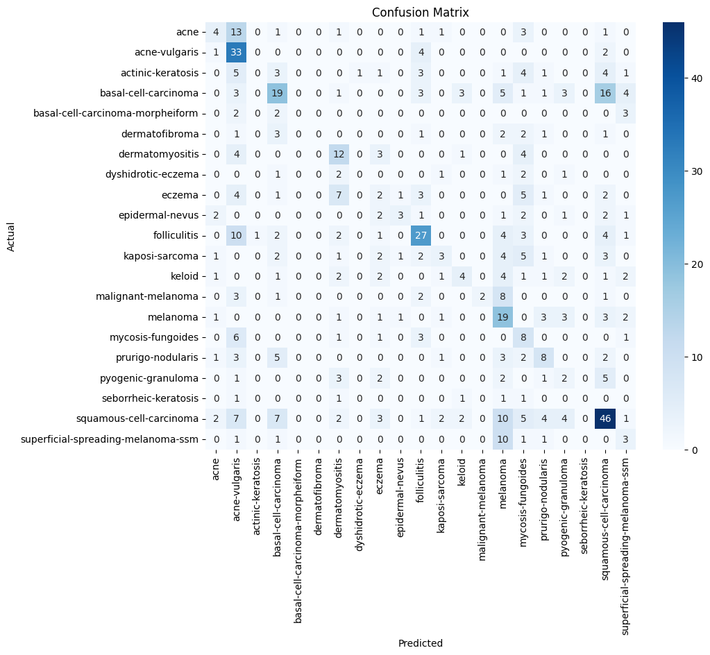
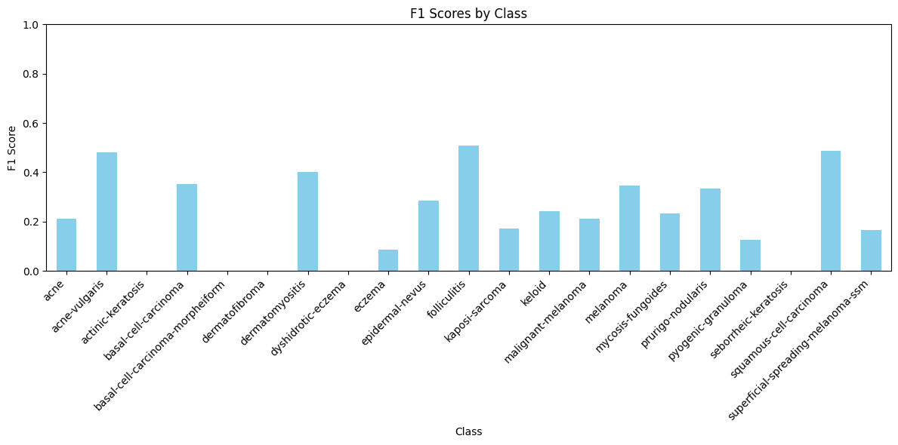

# Equitable AI for Dermatology Kaggle Competition - Team Kojic Acid README

---

### **👥 Team Members**

| Name | GitHub Handle | Contribution |
| ----- | ----- | ----- |
| Ariel Trusty | @Artrusty | Implemented explainability tools |
| Claire Cho | @claireecho | Loaded Dataset and Conducted EDA |
| Enrista Ilo | @enrista2112 | EDA and data augmentation |
| Oyu Enkhbold | @oyu-e | Built and trained CNN model |
| Zeynep Tasoglu | @ZeynepST | Performed EDA |
| Zuha Taha | @ztaha16 | Implemented explainability tools |

---

## **🎯 Project Highlights**

* Built a convolutional neural network (CNN) using transfer learning from a pre-trained ResNet-50 model to classify skin conditions equally across diverse skin tones. 
* Achieved an F1 score of 0.31 and a ranking of 31 on the final Kaggle Leaderboard
* Implemented data augmentation and image resizing to optimize results within compute constraints

🔗 [Equitable AI for Dermatology | Kaggle Competition Page](https://www.kaggle.com/competitions/bttai-ajl-2025/overview)

---

## **👩🏽‍💻 Setup & Execution**

### 📦 1. Clone the Repository

```bash
git clone https://github.com/your-username/Kojic-Acid.git
cd Kojic-Acid
```

---

### 📁 2. Access the Dataset

Download the dataset from the official Kaggle competition page:  
🔗 [BTT AI AJL 2025 – Dataset](https://www.kaggle.com/competitions/bttai-ajl-2025/data)

> Make sure you're logged into Kaggle and have accepted the competition rules before downloading.  
> After downloading, upload the dataset to your Google Drive and adjust the file paths in the notebook as needed.

---

### 📓 3. Run the Notebook in Google Colab

This project is designed to run easily in **Google Colab**.

Steps:
1. Open [Google Colab](https://colab.research.google.com/)
2. Upload or open the notebook file (e.g., `kojic_acid_model.ipynb`)
3. Mount your Google Drive:
    ```python
    from google.colab import drive
    drive.mount('/content/drive')
    ```
4. Make sure the dataset path in the notebook matches your Drive location
5. Run all cells

---

### ⚙️ 4. Install dependencies

```bash
pip install tensorflow pandas scikit-learn matplotlib seaborn
```

---

---

## **🏗️ Project Overview**

### 🏆 Kaggle Competition Explanation
AI governs access to information, opportunities, and freedom, but it can also reinforce harmful biases like racism and ableism, impacting areas like healthcare and justice. The Algorithmic Justice League (AJL) raises awareness of these harms through esearch, supporting advocates and communities most affected. One example is dermatology AI, which often underperforms for darker skin tones due to biased data, leading to health disparities. To address this, Break Through Tech and AJL invite participants to build a more inclusive dermatology AI model.

### 🎯 Challenge Objective
The objective is to train a machine learning model that can accurately identify 21 different skin conditions across a range of skin tones using the datasets provided on Kaggle and to create a final GitHub write-up that documents process and model. The README should also highlights how fairness and inclusion were prioritized. Tools like visualizations, explainability methods, or creative storytelling should be used.

### 🌎 Real-World Significance
This project addresses a major gap in healthcare AI, which is the lack of representation of diverse skin tones in dermatology tools. When AI models are trained mostly on lighter skin tones, they often misdiagnose or overlook conditions on darker skin. This can lead to delayed or incorrect treatment for those people. By building a more inclusive model, this project can help reduce those health disparities, improve diagnosis accuracy for everyone, and promote fairness in medical technology.

---
## **📊 Data Exploration**

**Dataset Overview:**
The primary dataset used for this project is a subset of the Fitzpatrick17k dataset, which contains approximately 4,500 images representing 21 skin conditions across diverse skin tones. The dataset is sourced from two reputable dermatology websites, DermaAmin and Atlas Dermatologico, and includes metadata such as:
* md5hash: An alphanumeric hash serving as a unique identifier for each image. It represents the file name of the image without the .jpg extension.
* fitzpatrick_scale: An integer in the range [-1, 0) and [1, 6] indicating the Fitzpatrick Skin Tone (FST) as self-described by the individual.
* fitzpatrick_centaur: An integer in the range [-1, 0) and [1, 6] indicating the Fitzpatrick Skin Tone (FST) as assigned by Centaur Labs, a medical data annotation firm.
* labels: The target variable representing the skin condition (e.g., squamous-cell-carcinoma, acne, melanoma).
* quality control (qc): Annotations by board-certified dermatologists indicating the diagnostic quality of the images.

The dataset is split into:
1. Training Set: Contains labeled images organized into subdirectories by skin condition.
2. Test Set: Contains unlabeled images for making predictions.

**Exploratory Data Analysis:**
* Class Distribution: The dataset is highly imbalanced, with some skin conditions (e.g., squamous-cell-carcinoma) having significantly more examples than others (e.g., basal-cell-carcinoma-morpheiform).


* Fitzpatrick Skin Tone Distribution: Darker skin tones (FST 4–6) are underrepresented compared to lighter skin tones (FST 1–3). This imbalance could lead to biased model performance.


**Preprocessing:**
* Data Augmentation: To address class imbalance, techniques like rotation, flipping, brightness adjustment, and zooming were applied to underrepresented classes.
* Class Weights: Class weights were computed to give more importance to underrepresented classes during training.
* Image Resizing: All images were resized to 160x160 pixels to reduce computational load.

**Visualizations:**


---

## **🧠 Model Development**

We used a convolutional neural network (CNN) with transfer learning, leveraging a pre-trained ResNet-50 model. On top of this, we added a custom classification head consisting of a global average pooling layer, a dense ReLU layer with dropout for regularization, and a layer with the softmax function to output probabilities for each skin condition class.

To optimize for Google Colab’s free tier GPU memory and runtime limits, we used slightly smaller image input sizes (160x160) instead of the standard sizes. This allowed us to speed up training and inference without significant drops in performance. This helped make the process more efficient and scalable on limited hardware.

We developed data exploratory analysis and used extensive data augmentation with ImageDataGenerator to increase dataset diversity and reduce overfitting. Augmentations included rotation, width/height shifts, horizontal/vertical flips, shear, zoom, and brightness adjustments. These were all useful for classifying skin condition images with varied orientation and lighting conditions.

The training set comprised 80% of the data, with the remaining 20% used for validations. Labels were encoded with Label Encoder, and the model was trained with Adam optimizer with a learning rate of 0.0001. We used early stopping and model checkpointing based on the validation accuracy to avoid overfitting. We evaluated performance on the validation set using metrics such as F1 score, accuracy, and a confusion matrix, allowing us to assess per-class performance and identify common misclassifications. This approach provided a balance between accuracy and training efficiency under limited compute.


---

## **📈 Results & Key Findings**

Our model achieved a 31st place finish on the Kaggle Leaderboard under the team name VIR_AJL_Team Kojic Acid. Evaluation on the validation set showed that the model performed well across a wide range of skin conditions, with strong alignment along the diagonal of the confusion matrix, indicating accurate class predictions.

Notably, the model correctly identified 33 cases of acne-vulgaris, 46 of squamous cell carcinoma, and 27 of folliculitis, among others. These strong per-class performances suggest that the model learned to distinguish meaningful visual patterns across a diverse set of dermatological conditions. Some overlap occurred in visually similar classes—for example, between acne and acne-vulgaris or basal and squamous cell carcinoma—which is expected given the complexity of skin condition classification.



The model achieved a weighted F1 score of 0.31, with precision and recall both at 0.34. F1 scores across classes ranged from 0.00 to 0.51, reflecting strong performance on certain classes and room for growth on others. Overall, these results demonstrate the model's potential in tackling a challenging, high-class-count classification task.




The confusion matrix visualization was particularly helpful in highlighting the model’s strengths and areas for refinement. Future work could build on this by exploring class merging or refining augmentation strategies.


---

## **🖼️ Impact Narrative**

**Answer the relevant questions below based on your competition:**

**WiDS challenge:**

1. What brain activity patterns are associated with ADHD; are they different between males and females, and, if so, how?
2. How could your work help contribute to ADHD research and/or clinical care?

**AJL challenge:**

As Dr. Randi mentioned in her challenge overview, “Through poetry, art, and storytelling, you can reach others who might not know enough to understand what’s happening with the machine learning model or data visualizations, but might still be heavily impacted by this kind of work.”
As you answer the questions below, consider using not only text, but also illustrations, annotated visualizations, poetry, or other creative techniques to make your work accessible to a wider audience.
Check out [this guide](https://drive.google.com/file/d/1kYKaVNR\_l7Abx2kebs3AdDi6TlPviC3q/view) from the Algorithmic Justice League for inspiration!

1. What steps did you take to address [model fairness](https://haas.berkeley.edu/wp-content/uploads/What-is-fairness_-EGAL2.pdf)? (e.g., leveraging data augmentation techniques to account for training dataset imbalances; using a validation set to assess model performance across different skin tones)
2. What broader impact could your work have?

---

## **🚀 Next Steps & Future Improvements**

**Address the following:**

* What are some of the limitations of your model?
* What would you do differently with more time/resources?
* What additional datasets or techniques would you explore?

---

## **📄 References & Additional Resources**

* Groh, M., Harris, C., Soenksen, L., Lau, F., Han, R., Kim, A., Koochek, A., & Badri, O. (2021). Evaluating deep neural networks trained on clinical images in dermatology with the Fitzpatrick 17k dataset. *arXiv preprint arXiv:2104.09957*. https://arxiv.org/abs/2104.09957
* “Building Computer Vision Applications with Python Online Class: LinkedIn Learning, Formerly Lynda.Com.” LinkedIn, www.linkedin.com/learning/building-computer-vision-applications-with-python. Accessed 22 Mar. 2025.

---
